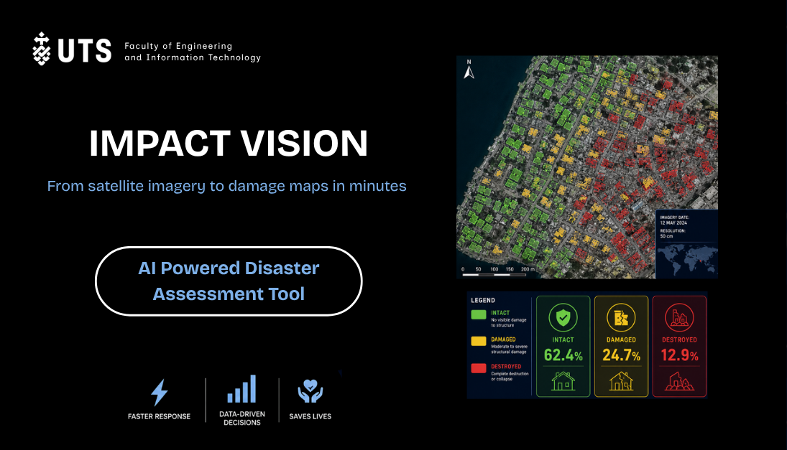
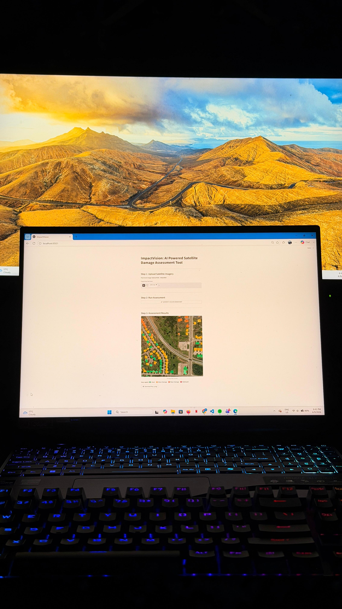
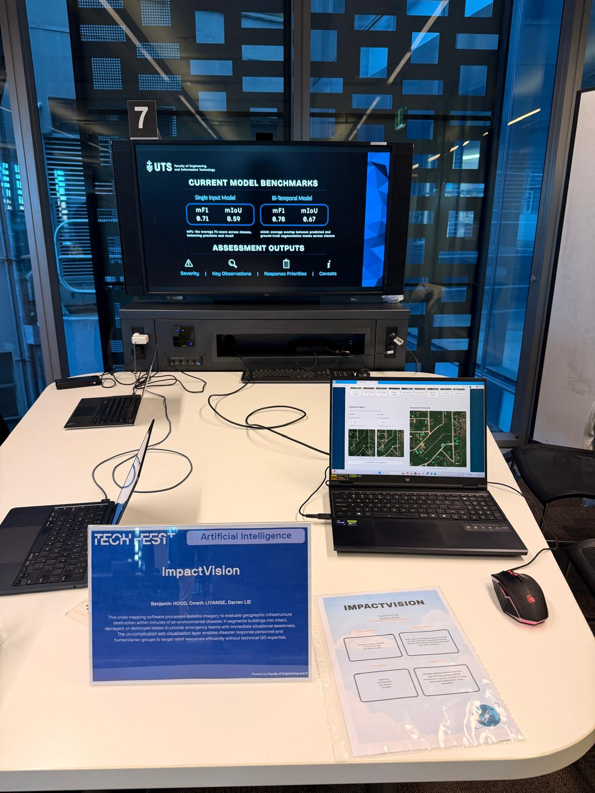

# ImpactVision — AI-Powered Satellite Building-Damage Assessment

<p align="center">
  
</p>

<table>
<tr>
<td width="50%" valign="top" align="center">
  <br>
  <em>The Streamlit app after a post-only assessment — buildings colour-graded by damage class.</em>
</td>
<td width="50%" valign="top" align="center">
  <br>
  <em>Demoed at UTS Tech Fest 2026 — live bi-temporal assessment alongside model benchmarks.</em>
</td>
</tr>
</table>

## Overview

ImpactVision is a deep-learning application for automated **building-damage assessment** from satellite imagery (xView2 / xBD). It segments every pixel into one of four classes and renders a colour-graded damage map, then an optional **local LLM** turns the result into a short, disaster-response-oriented written assessment.

**Classes:** `0 Background` · `1 Intact` · `2 Damaged` · `3 Destroyed`

The model is a **transformer-based DeepLabV3+**: a SegFormer-style **MiT / PVTv2** hierarchical transformer encoder (ImageNet-pretrained via `timm`) with the classic **DeepLabV3+ decoder** (ASPP + low-level skip). It ships in two modes, each with its own trained checkpoint:

| Mode | Input | How it works |
|---|---|---|
| **Post-only** | 1 post-disaster image | Single encoder pass → decoder. |
| **Bi-temporal (change detection)** | pre **and** post images | One **weight-tied (Siamese)** encoder runs over both; features are fused per scale as `[pre, post, |pre−post|]` to expose the change signal, then decoded. |

## Pipeline

```
 pre / post image(s)
        │
        ▼
 MiT / PVTv2 transformer encoder   ──►  4 feature maps (stride 4/8/16/32)
   (Siamese + change-fusion in bi-temporal mode)
        │
        ▼
 DeepLabV3+ decoder  (ASPP multi-scale context  +  low-level skip)
        │
        ▼
 per-pixel logits ──► argmax ──► damage class map ──► colour overlay + statistics
        │
        ▼
 Local LLM (Ollama)  ──►  written disaster-response assessment   [optional]
```

A lightweight auxiliary head provides deep supervision during training only and is unused at inference.

## Project Structure

```
project_root/
│
├── app/
│   ├── streamlit_app.py        # Streamlit UI (Post-Only and Pre+Post tabs)
│   ├── inference.py            # checkpoint loading + prediction router
│   ├── llm_feedback.py         # local-LLM (Ollama) assessment layer
│   └── assets/examples/        # bundled example pre/post scenes
│
├── checkpoints/
│   ├── semantic_seg_transformer/        # bi-temporal (Siamese) weights  (*.pth)
│   └── semantic_seg_transformer_post/   # post-only weights              (*.pth)
│
├── src/
│   ├── data/                   # datasets / loaders
│   ├── models/
│   │   └── deeplabv3/
│   │       └── deeplabv3plus_transformer.py   # the model definition
│   └── training/               # trainers / losses / metrics
│
├── requirements.txt
└── README.md
```

## Model Checkpoints

Place the trained weights in the two checkpoint folders. The app automatically selects the `*.pth` file with the **highest mIoU in its filename** (e.g. `..._mIoU_0.61.pth`), so you can keep several epochs and it will load the best:

```
checkpoints/semantic_seg_transformer/        <-  bi-temporal checkpoint(s)
checkpoints/semantic_seg_transformer_post/   <-  post-only checkpoint(s)
```

The bi-temporal vs post-only architecture is auto-detected from each checkpoint (a bi-temporal checkpoint contains `fusions.*` keys), so the correct model is rebuilt automatically — no config flag to keep in sync.

## Dependencies

Install the core dependencies from the project root:

```bash
pip install -r requirements.txt
pip install streamlit ollama        # if not already present
```

Key libraries: `torch`, `torchvision`, `timm` (pretrained encoder), `rasterio` (GeoTIFF), `streamlit` (UI), and `ollama` (LLM assessment, optional).

> The first run downloads the ImageNet-pretrained encoder weights via `timm`, so an internet connection is needed once.

## Running the Application

From the project root:

```bash
streamlit run app/streamlit_app.py
```

Streamlit prints a local URL (e.g. `http://localhost:8501`). Open it in your browser. The app has two tabs:

### Post-Only
1. Upload a post-disaster image (or pick a bundled **example scene**).
2. Click **GENERATE COLOUR-GRADED MAP**.
3. View the damage overlay and per-class statistics; download the PNG if needed.

### Pre + Post (Change Detection)
1. Upload a matching **pre** and **post** image pair (or pick an example scene).
2. Click **GENERATE COLOUR-GRADED MAP** — the bi-temporal model is used automatically.
3. View the overlay, statistics, and download.

**Supported formats:** PNG (`.png`), JPEG (`.jpg`, `.jpeg`), GeoTIFF (`.tif`, `.tiff`).

**Legend:** 🟩 Intact · 🟨 Damaged · 🟥 Destroyed (Background is transparent).

## AI Assessment (Local LLM)

After a damage map is generated, click **Generate AI Assessment** to get a concise, written disaster-response summary (severity, key observations, recommended response priorities, caveats). The model's per-class statistics — and the colour-graded damage map image — are sent to a **local LLM served by [Ollama](https://ollama.com)**; the CNN remains the source of truth for *what* is damaged, and the LLM only interprets and explains the result.

Setup:

```bash
ollama serve                 # start the local server (separate terminal)
ollama pull gemma3:4b        # or any model you prefer
```

Configuration (optional environment variables):

| Variable | Default | Purpose |
|---|---|---|
| `OLLAMA_MODEL` | `gemma4:e4b` | Model tag to use — must match a model you have pulled (`ollama list`). |
| `OLLAMA_HOST` | `http://localhost:11434` | Ollama server URL. |

```powershell
# example: use a smaller/faster model
$env:OLLAMA_MODEL = "gemma3:4b"
streamlit run app/streamlit_app.py
```

Notes:
- This feature is **optional** — the rest of the app works without Ollama. If the server isn't running or the model isn't pulled, the assessment shows a clean error instead of failing the app.
- **VRAM:** the segmentation model and the LLM share the GPU. A large model (e.g. a ~10 GB tag) will not fit on an 8 GB GPU alongside the CNN; choose a model that fits, or let Ollama run it on CPU.
